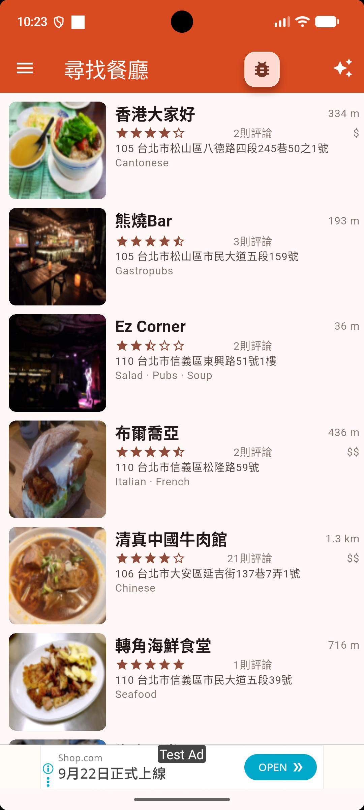
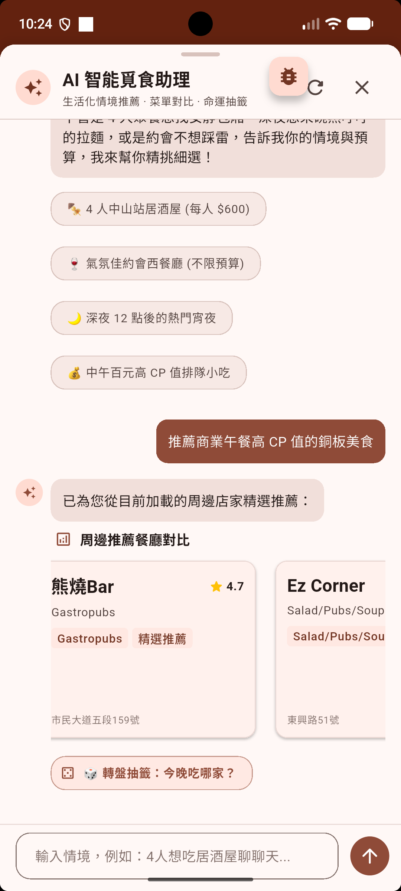
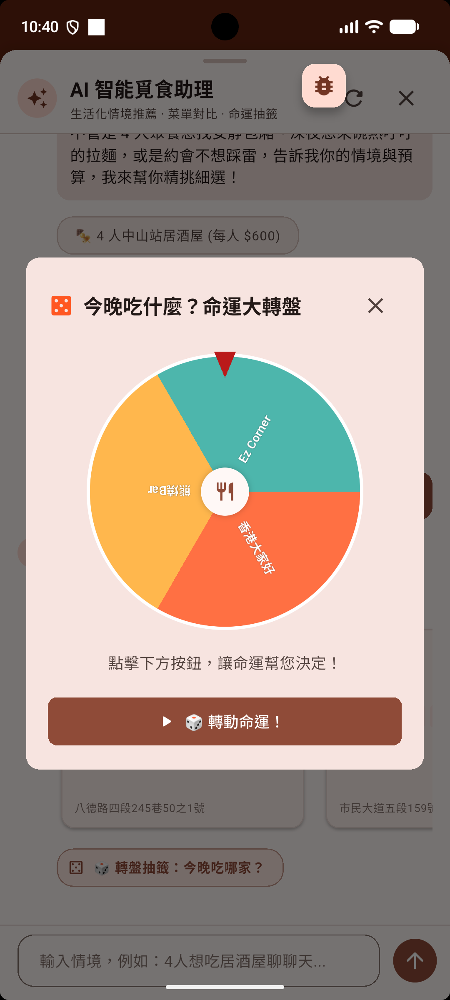
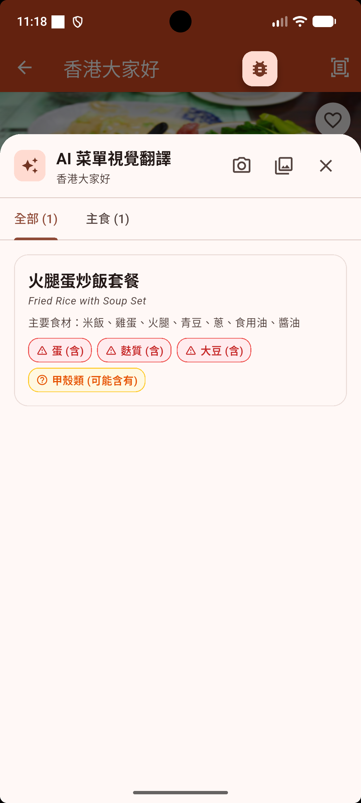
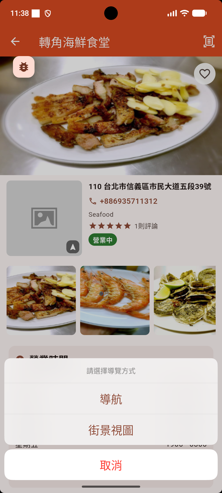
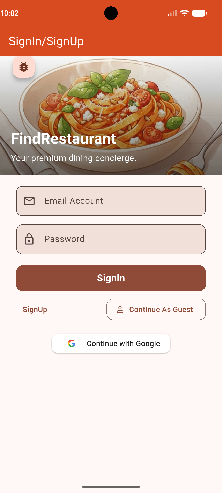

# Find Restaurant (尋找餐廳)

<p align="center">
  <b>以 Flutter 與 Firebase 打造的智慧美食探索與 AI 覓食助理跨平台應用程式。</b>
</p>

<p align="center">
  <a href="README.md">English</a> | <b>繁體中文</b>
</p>

---

## 📖 專案簡介

**Find Restaurant（尋找餐廳）** 是一款專為美食愛好者打造的跨平台探索 App。結合 **Yelp Fusion API** 與 **Firebase AI Logic (Google Gemini 3.5 Flash Lite)**，將在地生活化搜尋與新世代多模態生成式 AI 深度結合：

- **AI 智能覓食助理**：支援生活化自然語言情境推薦（如「4人中山站居酒屋 每人 $600」），藉由 GenUI (A2UI) 宣告式協定動態呈現店家對比卡片與行動建議標籤。
- **命運大轉盤**：將候選餐廳自動載入動態轉盤，自訂 Canvas 渲染互動式抽籤，為選擇困難症用戶輕鬆定奪「今天吃什麼」。
- **AI 拍菜單視覺辨識**：拍照即可翻譯外文菜單為繁體中文，並智慧解析食材成分與標示潛在過敏原（蛋、奶、海鮮、麩質等）。

專案嚴格遵循 **Clean Architecture 三層架構**、**BLoC (v9+) 單向資料流** 與 **GetIt 依賴注入**，兼顧程式碼高內聚低耦合。

---

## 📸 介面預覽

| 1. 首頁餐廳探索 (Home) | 2. AI 智能覓食助理 (AI Assistant) | 3. 命運大轉盤 (Decision Roulette) |
| :---: | :---: | :---: |
|  |  |  |
| **周邊餐廳探索與即時資訊**<br>距離、評分、價位與分類一覽 | **情境式對話與餐廳對比**<br>自然語意推薦與 GenUI 互動卡片 | **動態轉盤隨機抽籤**<br>互動抽籤解決聚餐選擇困難 |

| 4. AI 菜單視覺翻譯 (Menu Vision) | 5. 餐廳詳情與導航 (Navigation) | 6. 多元身分驗證 (Auth) |
| :---: | :---: | :---: |
|  |  |  |
| **多模態菜單辨識與過敏原**<br>食材拆解、中文翻譯與致敏警示 | **Google Maps 與路線導航**<br>路線規劃、街景視圖與店家致電 | **身分認證與訪客模式**<br>Google 登入、Email 註冊與訪客體驗 |

---

## ✨ 核心功能

- 📍 **周邊餐廳探索**：基於 GPS 定位的即時搜尋，支援分類篩選、星級評分、評論數與價格區間過濾。
- 🤖 **AI 智能覓食助理**：整合 Firebase AI Logic，支援複雜飲食情境對話（預算、人數、用餐氛圍、深夜宵夜等）。
- 🎡 **命運大轉盤**：GenUI 宣告式元件驅動，自訂 Canvas 動態扇形輪盤，旋轉抽籤決定聚餐店家。
- 📸 **AI 菜單視覺辨識**：支援相機即拍或相簿選圖，多模態神經網路分析外文菜色、食材明細與 7 大過敏原警示。
- 🗺️ **地圖導航與街景**：整合 Google Maps 地圖標記、路線規劃與街景視圖（Street View）。
- 🔐 **全方位會員系統**：Firebase Auth 支援 Google 第三方登入、Email 密碼登入及免登入訪客模式。
- 💖 **雲端收藏同步**：透過 Cloud Firestore 實時儲存並同步使用者的私房美食清單。

---

## 🏗️ 架構與技術棧

### Clean Architecture 分層
```text
表現層 Presentation Layer (UI & BLoC)
       │
       ▼
領域層 Domain Layer (Entities & Repository Interfaces) ◄── 核心業務契約 (僅依賴 equatable 處理值比對)
       ▲
       │
資料層 Data Layer (Repo 實作, DTOs, Data Sources)
       │
       ▼
外部服務 External Services (Yelp API, Firebase, Google Maps, Gemini)
```

### 技術棧清單
| 領域 / 分層 | 套件與工具 | 說明 |
| :--- | :--- | :--- |
| **Framework** | Flutter `>=3.44.1`, Dart `>=3.10.1` | 跨平台行動應用框架 (Material 3 & iOS Native) |
| **Architecture** | Clean Architecture, Feature-First | 表現層、領域層與資料層解耦 |
| **State Management** | `flutter_bloc ^9.1.1`, `equatable`, `rxdart` | BLoC 單向資料流、事件驅動與響應式處理 |
| **Dependency Injection** | `get_it ^8.0.0` | 服務定位器與依賴注入解耦 |
| **Generative AI** | `firebase_ai ^4.0.0` (Gemini 3.5 Flash Lite) | 多模態圖像識別、A2UI GenUI 結構化輸出 |
| **Network & REST** | `dio ^5.6.0`, `retrofit ^4.2.0` | 型別安全 API 客戶端與攔截器 |
| **Cloud Backend** | Firebase (`Auth`, `Firestore`, `Messaging`, `Storage`) | 身份驗證、實時資料庫、雲端推播與存儲 |
| **Maps & Location** | `google_maps_flutter ^2.4.0`, `geolocator ^14.0.3` | GPS 定位、路徑導航與地圖圖層 |
| **Local Storage** | `sqflite ^2.3.0`, `shared_preferences ^2.2.0` | 本地 SQLite 快取與偏好設定 |
| **Cross-Platform UI** | `flutter_platform_widgets ^10.0.1` | iOS Cupertino 與 Android Material 3 動態適配 |

---

## 🚀 開發指南

### 環境需求
- [Flutter SDK](https://flutter.dev/docs/get-started/install) (3.44.1+)
- [Dart SDK](https://dart.dev/get-dart) (3.10.1+)
- Xcode 15+ (適用於 iOS 開發) / Android Studio (適用於 Android 開發)
- Yelp Fusion API Key & Google Maps API Key
- Firebase 專案設定檔 (`google-services.json` 與 `GoogleService-Info.plist`)

### 安裝與啟動步驟

```bash
# 1. Clone 專案
git clone https://github.com/Yomiamy/Finding-Restaurant-Flutter.git
cd Finding-Restaurant-Flutter/flutter_restaruant/flutter_restaruant

# 2. 安裝套件依賴
flutter pub get

# 3. 執行程式碼生成 (Retrofit / JSON Serializable)
dart run build_runner build --delete-conflicting-outputs

# 4. 啟動應用程式
flutter run
```
