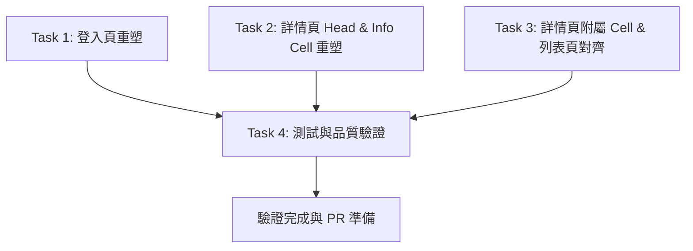

# S3 — 頁面級視覺重塑 (登入頁 / 餐廳詳情頁 / 列表頁) 實作計畫

> **文件狀態**：STAGE 0b 實作計畫 (How)  
> **依據規格**：`docs/features/2026-08-27-remodel-page-level-views.md`  
> **撰寫日期**：2026-08-27  

---

## 1. 架構與設計決策 (Architecture & Design Decisions)

本計畫以純表現層（Presentation Layer）重塑為核心，嚴格遵循專案之 Style Guide 與 Linus 模式原則：
1. **零業務邏輯破壞**：不更改 BLoC Events/States 與 Navigator 路由行為，只改進視覺呈現與佈局彈性。
2. **消滅硬編碼顏色**：清除 `sign_in_page.dart` 中的硬編碼藍 `Color.fromARGB(255, 5, 97, 245)` 與散落各處的 `Colors.grey` / `Colors.blue`，一律使用 `Theme.of(context).colorScheme` 與 `ThemeColor`。
3. **消除 PNG 依賴**：詳情頁最愛按鈕改用 Material 3 原生向量 `Icons.favorite` 與 `Icons.favorite_border`，移除 2 張 PNG 圖檔及 `pubspec.yaml` 設定。
4. **小螢幕彈性適配**：登入頁以 `SingleChildScrollView` + `SafeArea` 包覆，圖片維持固定/彈性高度，徹底防止鍵盤彈出時的 RenderFlex 溢出。

---

## 2. 任務拆分與檔案異動 (Task Breakdown)

### 任務 1: 登入頁重塑 (`SignInPage`)
- **目標檔案**：
  - `lib/flow/signinup/view/sign_in_page.dart`
- **實作內容**：
  - 將主登入按鈕背景色改為 `Theme.of(context).colorScheme.primary`（品牌橘紅），移除 `Color.fromARGB(255, 5, 97, 245)`。
  - 將 Email / 密碼輸入框升級為標準 M3 `TextFormField` + `InputDecoration`（`prefixIcon`、`filled: true`、`OutlineInputBorder` 與 `ThemeSize.radius12`）。
  - 重構按鈕視覺階級：主按鈕（Filled）、次按鈕（Google/Apple）、輔助按鈕（註冊與訪客模式，文字顏色改用 `colorScheme.primary` 或 `colorScheme.onSurfaceVariant`）。
  - 將外層 `Column(children: [Expanded, Expanded])` 改為可滾動結構 `SingleChildScrollView`，頂部 gif 圖設定固定適配高度（如 160-200），避免小螢幕彈鍵盤 overflow。

### 任務 2: 餐廳詳情頂部與資訊重塑 (`RestaurantHeadCell`, `RestaurantInfoCell`)
- **目標檔案**：
  - `lib/component/cell/restaurant_detail/restaurant_head_cell.dart`
  - `lib/component/cell/restaurant_detail/restaurant_info_cell.dart`
  - `pubspec.yaml`
  - 刪除 `images/ic_favor_fill.png` 與 `images/ic_favor_empty.png`
- **實作內容**：
  - `RestaurantHeadCell`：
    - 圖片與 Placeholder 改為 `BoxFit.cover`。
    - 收藏按鈕改用 `Icons.favorite`（紅色）與 `Icons.favorite_border`（深灰/白色半透明圓底），移除 PNG 圖檔引用。
  - `RestaurantInfoCell`：
    - 靜態地圖圖片改為 `BoxFit.cover` 並套用 `ClipRRect(borderRadius: BorderRadius.circular(ThemeSize.radius8))`。
    - 營業狀態（OPEN/CLOSE）：若 `isOpen` 為 true 顯示綠色語意標籤（`Colors.green.shade700` 或 `colorScheme.tertiary`），若為 false 顯示灰/深色標籤，消滅營業中顯示紅底之 Bug。
    - 電話欄位：改用 `colorScheme.primary` 並附加 `Icons.phone` 圖示，維持點擊撥打行為。
    - 分類串接字串改以 ` · ` 分隔。

### 任務 3: 餐廳詳情附屬 Cell 與列表頁對齊 (`RestaurantBusinessHourCell`, `RestaurantCommentCell`, `MainPage`)
- **目標檔案**：
  - `lib/component/cell/restaurant_detail/restaurant_business_hour_cell.dart`
  - `lib/component/cell/restaurant_detail/restaurant_comment_cell.dart`
  - `lib/flow/restaurant/view/restaurant_detail_page.dart`
  - `lib/flow/main/view/main_page.dart`
  - `lib/flow/main/view/restaurant_info_list_widget.dart`
- **實作內容**：
  - `RestaurantCommentCell`：使用者頭像加入圓角與 `BoxFit.cover`，文字樣式對齊 Token。
  - `RestaurantBusinessHourCell`：今日營業時間以粗體或主題色高亮，間距採用 `ThemeSize`。
  - `MainPage` & `RestaurantDetailPage`：消除 `_buildAppBar` 與 `Drawer` 中 `Colors.white` 硬編碼，統一替換為 `ThemeColor.colorffffff`。

### 任務 4: 測試與品質驗證 (Tests & Quality Assurance)
- **目標檔案**：
  - `test/flow/signinup/sign_in_page_test.dart`（新增或擴充）
  - `test/component/restaurant_head_cell_test.dart`（新增）
  - `test/component/restaurant_info_cell_test.dart`（新增）
- **實作內容**：
  - 驗證 `SignInPage` 渲染正常、按鈕能正確觸發事件、輸入驗證生效。
  - 驗證 `RestaurantHeadCell` 收藏點擊觸發與狀態圖示正確。
  - 驗證 `RestaurantInfoCell` 營業狀態（OPEN 綠底 / CLOSE 灰底）與電話顯示。
  - 執行 `flutter analyze` 確保 0 警告、`flutter test` 100% 通過、`dart format`。

---

## 3. 執行順序 (Execution Sequence)

